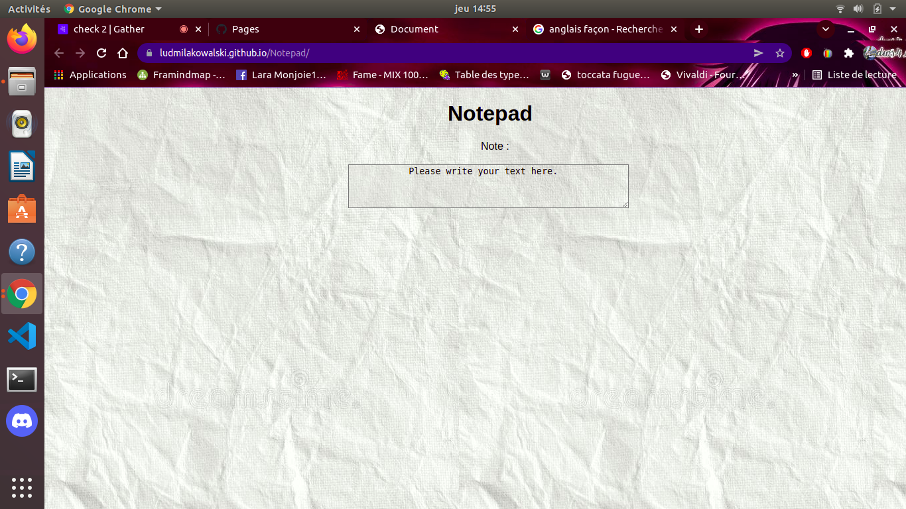
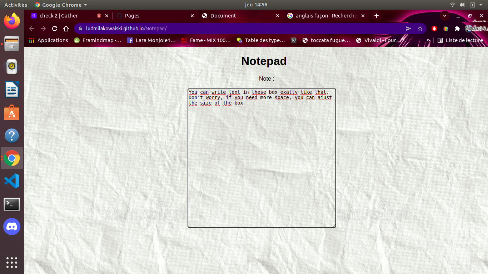

# Notepad-Bonus exercice

## Instructions

We had to create a notepad. 

## Techno

I used html, css and Javascript.

## Result

You can see the result here : 

With text :

With a larger box

## Link

https://ludmilakowalski.github.io/Notepad/
